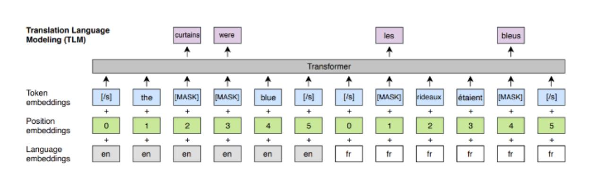
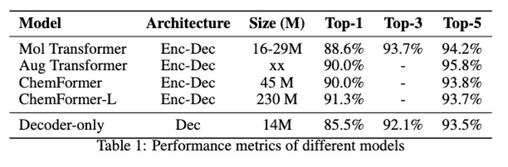

# RXN GPT: Decoder-Only Model for Chemical Reaction Experiments

RXN GPT is a full reimplementation of a decoder-only architecture for machine translation, specifically designed for chemical reaction experiments. It includes the following features (non-optimized):

- Separate positional encodings for source (reactant) and target (product) tokens.
- SRC/TGT encoding that functions like language embeddings.
- Bidirectional attention on SRC tokens (Prefix-LM style).

**Note:** Inference is currently non-optimized and may be slower compared to other implementations. This project serves as a toy architecture to evaluate the accuracy of decoders for chemical translation tasks.

---

## Architecture and Results

### Architecture Diagram


### Results


---

## Environment Setup

To set up the environment for running the RXN GPT model, follow these steps:

1. **Clone the Repository:**
   ```bash
   git clone https://github.com/sachaRfd/rxnGPT.git
   cd rxngpt
   ```

2. **Create Conda Environment:**

   ```bash
   conda create -n rxngpt python=3.12.2 -y
   conda activate rxngpt
   pip install -e .
   ```

## Training the Model:

### Training Script

Modify the model configurations in the configs directory and run the training script:

```bash
python src/rxngpt/train_decoder.py --config PATH/TO/CONFIG
```

### Training Strategy

1. Pretraining:

- Train the model on both SRC and TGT tokens to predict all next tokens.

- This helps the model learn the general structure of the data.

2. Fine-Tuning:

- Fine-tune the model on TGT tokens only.

- The model attends to all SRC tokens, and the loss is calculated only on TGT tokens, mimicking inference conditions.

### Best Hyperparameters

1. Pretraining:

- block_size: 560

- n_layer: 8

- n_head: 8

- n_embd: 128 x 4

- dropout: 0.1

- bias: false

- learning_rate: 0.0001

- batch_size: 64

- accumulation_steps: 4

- Use SRC-TGT language mask.

- Use separate positional embeddings.

2. Fine-Tuning:

- Use the same parameters as pretraining but train on TGT tokens only.


## Sampling from the Model

To generate samples from a trained model, add the path to your trained checkpoint in the config file and run:

```bash
python src/rxngpt/sample_decoder.py --config PATH/TO/CONFIG
```
